# OS LAB 1    Rust与双链表

提交截止时间：2023年3月12日24时

[TOC]

## 简介

在这个实验中，你需要自学**Rust**语言，并根据提示实现一个简单的**双链表**（可以使用Unsafe）。

这是一个单人项目，你需要**独立完成**项目。我们提供了若干测试用例，你的代码需要能够通过测试用例。作为我们评分的标准，你需要提交**代码**以及一份简短的**实验报告**。实验报告的内容可以包括下面的三个部分：

* Rust学习心得 or 笔记 or 学习记录 
* 简要描述你的整体设计
* 对Rust实现链表其他方法的探究 or 实验中遇到的困难 or 对本实验的内容和难度的反馈   

共2页左右即可。  

我们推荐你使用以下两本书进行学习：

* [Rust圣经](https://course.rs/about-book.html)
* [Learn Rust With Entirely Too Many Linked Lists](https://rust-unofficial.github.io/too-many-lists/#learn-rust-with-entirely-too-many-linked-lists)（中文版：[手把手带你实现链表](https://course.rs/too-many-lists/intro.html#手把手带你实现链表)）

前者你可以学习到Rust的基本语法，而后者可以帮助你完成这个lab。你可能并不需要完整地看完它们的全部内容。但是下面这些知识点你可能会用到：

* [生命周期](https://course.rs/advance/lifetime/intro.html)
* [迭代器](https://course.rs/advance/functional-programing/iterator.html)
* [智能指针](https://course.rs/advance/smart-pointer/box.html)
* [循环引用与自引用](https://course.rs/advance/circle-self-ref/intro.html)
* [闭包 Closure](https://course.rs/advance/functional-programing/closure.html)
* [使用 use 及受限可见性](https://course.rs/basic/crate-module/use.html)
* [泛型和特征](https://course.rs/basic/trait/intro.html)
* [标准库的双链表实现](https://rust-unofficial.github.io/too-many-lists/sixth.html)

如果你希望更深入的学习Rust，或者你觉得某方面的知识点没有理解，你还可以参考以下视频和文档：

* [Rust 程序设计语言](https://kaisery.github.io/trpl-zh-cn/)
* [通过例子学 Rust](https://rustwiki.org/zh-CN/rust-by-example/)
* [清华计算机系大一学生2022暑期课程：Rust程序设计训练（有课程视频）](https://lab.cs.tsinghua.edu.cn/rust/)
* [rust-lang/rustlings: Small exercises to get you used to reading and writing Rust code!](https://github.com/rust-lang/rustlings)

## 评分标准

| 部分   | 子项                                                         | 分值                                          |
| ------ | ------------------------------------------------------------ | --------------------------------------------- |
| Part 1 | -                                                            | `test_rev_for_loop``test_iter`5分，其余5个每个测试点4分，共30分                                 |
| Part 2 | -                                                            | `test_get`,`test_remove`,`test_insert` 每个7分，其他（3个）每个8分，共45分                                |
| Part 3 |                                                              | 选做 |
| 报告   | -                             | 25分                                           |
| 总分   |                                                              | 100分                                         |


## 环境的搭建和项目说明

本小节将介绍如何搭建一个Rust环境，并运行项目中的测试。你可以直接参考[安装 Rust 环境 - Rust语言圣经(Rust Course)](https://course.rs/first-try/installation.html)搭建环境。

### Windows 下Rust的安装

点击链接[Rust安装包](https://static.rust-lang.org/rustup/dist/x86_64-pc-windows-msvc/rustup-init.exe) 下载，或者在[Rust网站](https://www.rust-lang.org/learn/get-started)上面找到对应的链接。

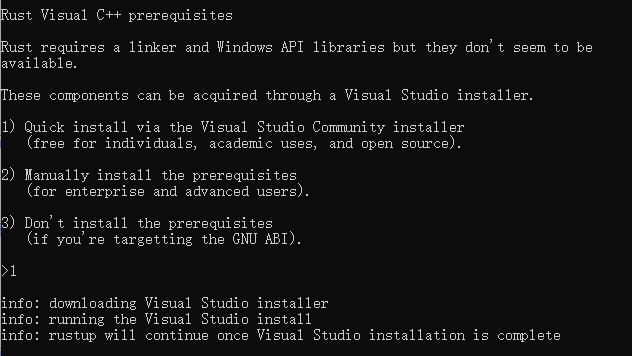

你可以选择1使用msvc版本，需要下载Microsoft C++ Build Tools（如果没装过VS Studio, 会自动安装，需要5GB空间）；或者安装在msys上面（见[安装 Rust 环境 - Rust语言圣经(Rust Course)](https://course.rs/first-try/installation.html#在-windows-上安装-rustup)）。

安装的流程一路按确定就可以：

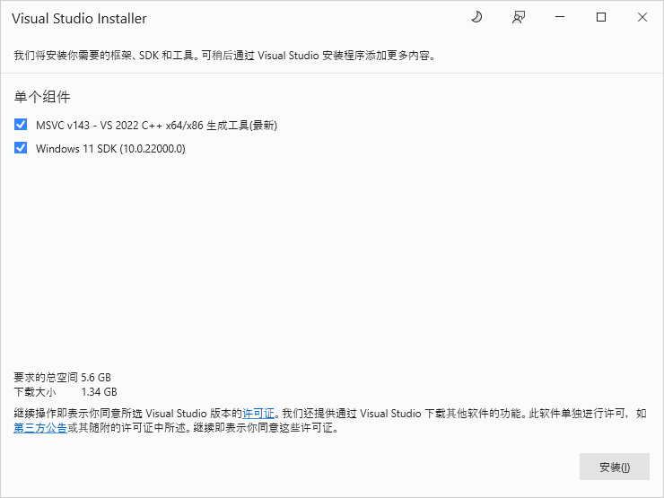


自动安装完成后，旁边的控制台会打印类似这样的输出：

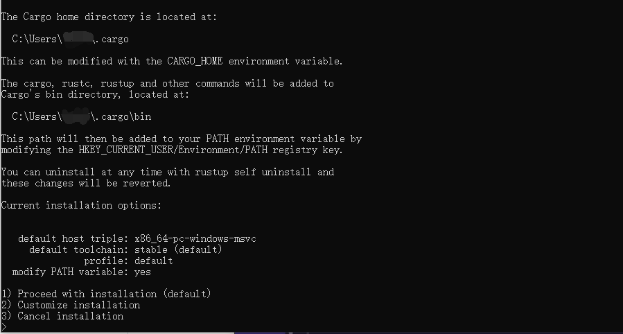

输入1，默认安装即可。

> 你可能会因为网络原因无法下载成功，这时可以切换源进行下载。编辑系统环境变量，添加下面两个环境变量：
>
> RUSTUP_DIST_SERVER=<https://mirrors.ustc.edu.cn/rust-static>
> RUSTUP_UPDATE_ROOT=<https://mirrors.ustc.edu.cn/rust-static/rustup>
>
> 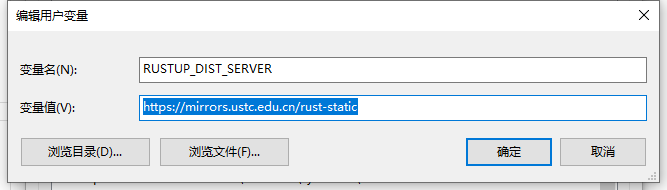
>
> 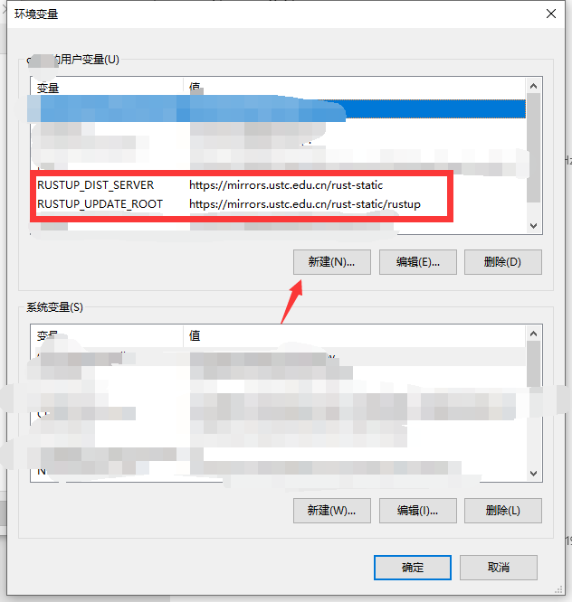
>
> 重新打开rustup-init.exe即可

安装成功时，会看到这样的界面：

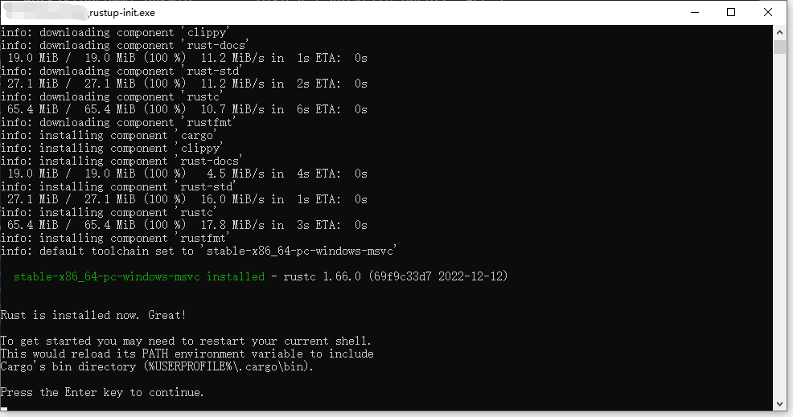

这里提示说我们要配置以下环境变量。在PATH里面添加`%USERPROFILE%\.cargo\bin`

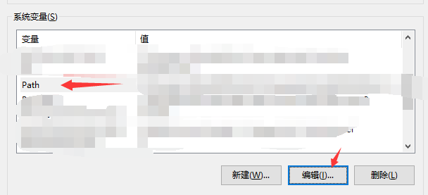

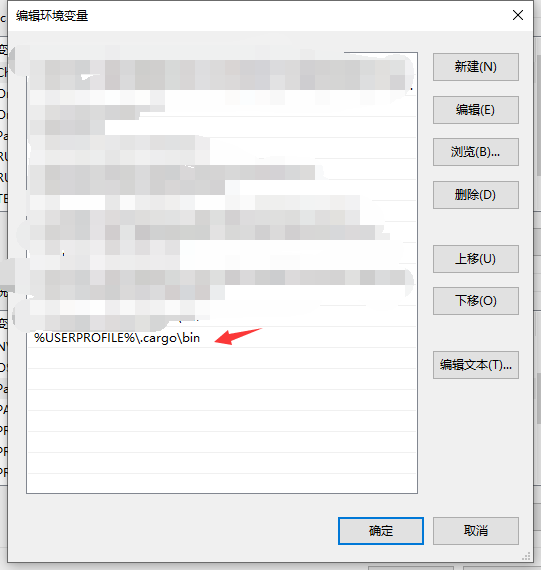

最后，可以在命令行下面验证是否安装完成


### Linux和Mac OS下的安装

命令行中输入下面这行即可：

```bash
curl --proto '=https' --tlsv1.2 https://sh.rustup.rs -sSf | sh
```

> 你可能会因为网络原因无法下载成功，你可以直接在浏览器内输入链接访问下载，也可以切换镜像地址，下面是中科大的镜像服务器：
>
>  ```bash
>  export RUSTUP_DIST_SERVER=https://mirrors.ustc.edu.cn/rust-static
>  export RUSTUP_UPDATE_ROOT=https://mirrors.ustc.edu.cn/rust-static/rustup
>  curl https://sh.rustup.rs -sSf | sh
>  ```
>
> 如果要让代理永久生效的话，可以把环境变量加入到`bashrc`里面：
>
>  ```bash
>  echo 'export RUSTUP_DIST_SERVER=https://mirrors.ustc.edu.cn/rust-static' >> ~/.bashrc
>  echo 'export RUSTUP_UPDATE_ROOT=https://mirrors.ustc.edu.cn/rust-static/rustup' >> ~/.bashrc
>  ```

当运行成功时，你会遇到选择数字的界面，选择1即可：

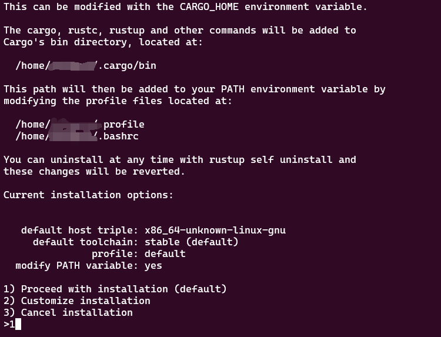

最后，运行下面的命令配置shell：

```bash
source "$HOME/.cargo/env"
```

你可以输入`rustc -V`查看rust版本，以验证是否安装成功。

### IDE环境

推荐使用vscode作为IDE，也可以使用CLion。

Vscode链接：[Windows](https://vscode.cdn.azure.cn/stable/1ad8d514439d5077d2b0b7ee64d2ce82a9308e5a/VSCodeUserSetup-x64-1.74.1.exe), [Mac OS](https://vscode.cdn.azure.cn/stable/e8a3071ea4344d9d48ef8a4df2c097372b0c5161/VSCode-darwin-universal.zip)

在Vsode Extensions中，找到rust-analyzer，Install即可

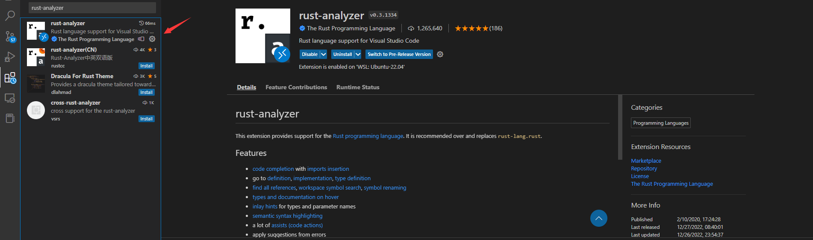

> 如果下载插件用时过久，可以尝试使用代理。参考这篇说明：[Visual Studio Code代理设置](https://device.harmonyos.com/cn/docs/documentation/guide/vscode_proxy-0000001074231144)

### 运行项目的测试

使用vscode打开项目的目录。打开src/tests.rs文件。如果插件运行正常，你会看到类似这样的按钮：

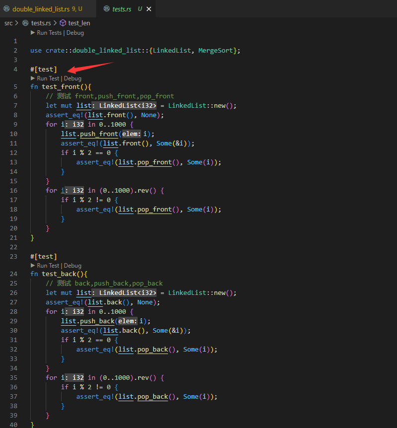

点击Run Tests，就可以运行测试；如果你安装了gdb等调试器，在需要断点的行号位置点击一下，点击Debug就可以进行断点和调试了。

当测试失败时，你会看到红色的提示，以及对应调用栈。你可以找到错误的行号；

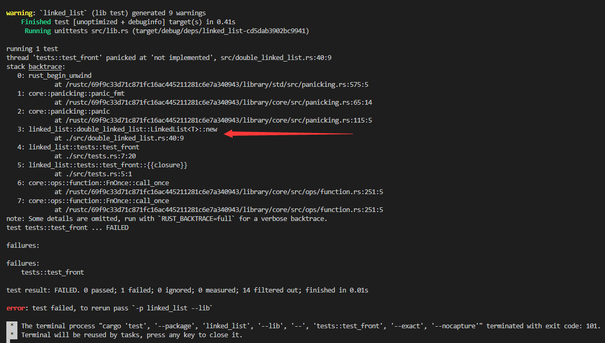

而当测试通过时，你会看到绿色的提示。

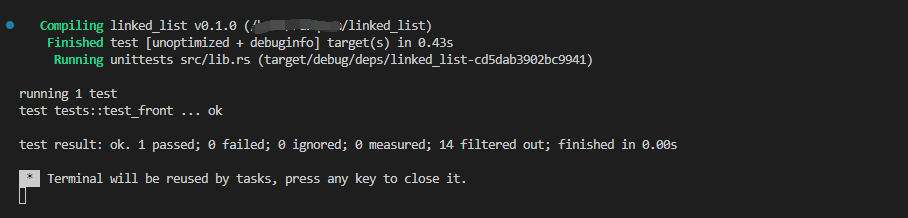

对于答案错误的情形，你还会看到期望的结果和输出的结果：

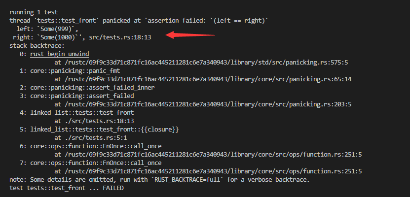

在`src/libs.rs`中，我们提供了运行多个测试的函数，你可以点击`run tests`进行测试。或者使用cargo命令运行单元测试。

### 项目文件说明

```
.
├── Cargo.lock    cargo生成的文件，用于管理依赖
├── Cargo.toml    用户配置包管理的地方
├── README.md     实验指导手册 markdown 版本
├── README.pdf    实验指导手册 pdf 版本
├── assets        实验指导手册的图片等资源            
└── src           项目源代码
    ├── double_linked_list.rs  * 双链表的实现 （主要需要实现的部分）
    ├── lib.rs                 管理对外接口；这里还提供了一些测试函数。
    └── tests.rs               测试用例
```

### 需要实现的部分

你需要补全`src/double_linked_list.rs`中的代码，并让它通过对应的测试。我们已经在你需要补充的部分加上了`TODO: YOUR CODE HERE` 的标记，你可以在拓展中心安装`TODO Hightlight` 插件以得到一个醒目的标记。
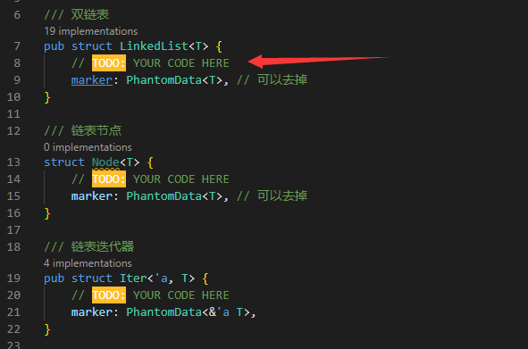
当然，如果需要的话，你可以在其他地方添加代码。

在编写时，你需要先删掉`unimplemented`；对于`PhantomData`,你可以删掉也可以保留。

在一些函数中，参数的变量使用`_`作为前缀，表明这个函数没有被用到；当你用到这个参数时，建议把`_`前缀删掉。

> `PhantomData` 的作用是什么？
>
> 在这里，我们主要用PhantomData来表示未使用的生命周期和类型参数。例如，迭代器中需要取链表元素的引用，这时候需要一个生命周期。而如果你用的是类似裸指针直接指向链表元素的方式，那结构体里就没有带引用的成员，不能加上`'a`的生命周期符号
>
> ```
> impl<'a, T> Iterator for Iter<T> {
>     type Item = &'a T;
>     
>     // .....
> }
> ```
>
> 这时候编译器会提示说`the lifetime parameter 'a is not constrained by the impl trait, self type, or predicate`。
>
> 因此我们需要在Iter上面添加生命周期符号。`PhantomData` 就是这样一种解决方式。它是一种零成本抽象，本身不占空间，只是让编译器以为当前结构体会拥有一个生命周期为'a的成员，从而通过编译。你可以阅读[官方的文档和例子](https://doc.rust-lang.org/std/marker/struct.PhantomData.html)深入了解。
>
> 让编译器以为结构体拥有类型的所有权还可以让编译器进行drop check，感兴趣可以阅读这个关于Box实现的博客：[讲讲让我熬了几天夜的Drop Check](https://ng6qpa7sht.feishu.cn/docx/LGnVdlqwGoIUpuxUMWRcptEbndd)

## Part 1 链表的基本功能

在Rust实现一个安全，高效的双链表是比较复杂的。Rust 非常注重安全性和内存管理。在 Rust 中，你需要清楚地指定哪些对象可以使用哪些资源，以及在何时何地释放这些资源。这就是所谓的所有权（ownership）和借用（borrowing）机制。

为实现指针的效果，常见的工具有所有权，引用，智能指针。所有权不适用于链表，在所有权的情况下，前驱和后继不能互为owner。引用可能会出现生命周期有问题的情况。比如有时候需要后面的节点生命周期比前面长，有时候则要反过来。解决引用生命周期问题可以使用智能指针`Rc`（引用计数）。引用还有一个问题，就是不能对一个对象同时可变引用多次。这个问题使用`RefCell`(内部可变性)解决。`RefCell`告诉编译器这个结构体是不可变的（实际上内部是可变的）。因此，实现单链表的一个经典组合是`Rc<RefCell<Node<T>>>`。但是放到双链表上面，这个组合会有一些问题。因为每个节点都有两个指针，因此会产生一个循环计数。如果用运行时检查可以解决部分问题，但是实现迭代器可能无法返回引用：[不太优秀的双端队列-迭代器](https://course.rs/too-many-lists/deque/iterator.html)。

目前的双链表的实现方案有很多：

* 使用`Weak`智能指针。把两个`Rc<RefCell<Node<T>>>`的一个指针换成弱指针。例如，这里把所有的prev指针换成了Weak的指针：[50行在stable,safe Rust实现双链表](https://play.rust-lang.org/?gist=71c6bc45ff92452d5a4397ddb2dbb3de&version=stable)

* 使用`unsafe`，像C/C++那样手动管理指针。这也是`collections::Linkedlist`中的实现方案。具体来说，就是管理节点的时候就用box::from_raw/into_raw来添加节点，直接使用裸指针解引用来访问数据。
* 使用`arena`([Region-based memory management](https://en.wikipedia.org/wiki/Region-based_memory_management))。`Arenas` 本质上是一种将预期生命周期相同的内存进行分组的模式。比如说有时需要在某个生命周期内分配一堆对象，之后这些对象将被全部销毁。这可以简单理解为一个堆空间。我们可以用类似C/C++中的方式new一个对象，然后显式地释放（不释放也可以，后面一起销毁）。这样就规避了Rust中声明周期的问题。关于`arena`的库，可以参考：[「译」Arenas in Rust](https://rustmagazine.github.io/rust_magazine_2021/chapter_3/arenas-in-rust.html#译arenas-in-rust)。同时，这里也有一个实现链表的例子：[基于slotmap实现链表](https://www.zhihu.com/question/54265676/answer/1679897001)
* `crossbeam-epoch`： 这是一种基于epoch的无锁GC。相当于自动帮我们管理声明周期了，这也就没有之前的那么多问题了。
* `GhostCell+StaticRc` ： `GhostCell` 提供了一种零开销的内部可变机制，`StaticRc`则提供了零开销的共享所有权机制，可以结合二者实现安全零开销链表。

在这一部分，你可以阅读[Learning Rust With Entirely Too Many Linked Lists](https://rust-unofficial.github.io/too-many-lists/)其中的An Ok Unsafe Queue和A Production Unsafe Deque章节来设计和实现你的链表。

首先，你需要完善`struct LinkedList<T>` 和`struct Node<T>` 的结构体，并完成下面的方法：

* `new`
* `len`
* `front`
* `front_mut`
* `back`
* `back_mut`

它们都仅需要几行代码就能完成。

接下来开始处理插入操作。

* `push_front`
* `pop_front`
* `push_back`
* `pop_back`

它们的语义和函数名相同，你也可以参考函数名上的注释。

如果你的实现正确，你应该可以通过：

* `test_front`
* `test_back`
* `test_len`

3个测试。

> 你可以在项目根目录打开一个命令行，运行`cargo test test_front`,`cargo test test_back`逐一运行测试，也可以通过vscode点击测试函数上的run test运行测试。
>
> 在lib.rs中，我们提供了一次运行多个测试的函数`test_part1`，你可以一次运行多个测试点。

---

接下来是迭代器部分。迭代器是一个维护链表迭代的数据结构。你可以先尝试实现一个单向的迭代器，这可能需要一个指向当前迭代数据的指针，数据的长度。完善`Iter`和`IterMut`之后，为链表提供一个返回迭代器的接口`iter`和`iter_mut`

然后我们为迭代器实现`Iterator trait` 。这个trait（可以认为是接口）要求我们实现`next`和`size_hint`两个函数。`next`返回一个元素，并把迭代器指针往后移动。`size_hint`需要返回元素下界和上界。`size_hint()` 主要用于优化，比如为迭代器的元素保留空间。你可以直接返回(链表长度,Some(链表长度))。

最后为链表实现反向的迭代。修改`Iter`使其包含一个反向的指针，然后为迭代器实现`DoubleEndedIterator` 的trait。

如果你的实现正确，你应该可以通过：

* `test_iter`
* `test_iter_mut`
* `test_for_loop`
* `test_rev_for_loop`

4个测试。

## Part 2 6个简单的链表操作

下面你需要自己实现6个简单的链表操作：

* `get/get_mut` ： 获取下标为at的元素的引用
* `remove` ： 删除下标为at的元素
* `insert` ： 插入一个元素到指定位置
* `contains` ： 判断链表内是否存在元素
* `split_off`：将链表分割成两个链表，原链表为[0,at-1]，新链表为[at,len-1]
* `find_mut` ： 找到链表中满足匹配条件的元素，返回它的引用

如果上面的表述不清楚，你可以参考这些函数上面的注释中的`examples`。

如果你的实现正确，你应该可以通过：

* `test_get`
* `test_remove`
* `test_insert`
* `test_contains`
* `test_split`
* `test_find_mut`

6个测试。

## Part 3 归并排序(选做)

在这一部分，你需要给链表写一个**就地**的归并排序。如果你忘了归并排序怎么写，你可以参考[leetcode 链表排序](https://leetcode.cn/problems/7WHec2/)的实现。

下面是递归实现的[伪代码](https://en.wikipedia.org/wiki/Merge_sort):

```pseudocode
function merge_sort(list m) is
    // Base case. A list of zero or one elements is sorted, by definition.
    if length of m ≤ 1 then
        return m

    // Recursive case. First, divide the list into equal-sized sublists
    // consisting of the first half and second half of the list.
    // This assumes lists start at index 0.
    var left := empty list
    var right := empty list
    for each x with index i in m do
        if i < (length of m)/2 then
            add x to left
        else
            add x to right

    // Recursively sort both sublists.
    left := merge_sort(left)
    right := merge_sort(right)

    // Then merge the now-sorted sublists.
    return merge(left, right)
    
function merge(left, right) is
    var result := empty list

    while left is not empty and right is not empty do
        if first(left) ≤ first(right) then
            append first(left) to result
            left := rest(left)
        else
            append first(right) to result
            right := rest(right)

    // Either left or right may have elements left; consume them.
    // (Only one of the following loops will actually be entered.)
    while left is not empty do
        append first(left) to result
        left := rest(left)
    while right is not empty do
        append first(right) to result
        right := rest(right)
    return result
```

如果你需要为你的实现添加辅助函数，可以在`impl<T:PartialOrd+Default> LinkedList<T>`块中进行编写。

如果你的实现正确，你应该可以通过：

* `test_merge_sort1`
* `test_merge_sort2`
* `test_merge_sort3`

3个测试

## 提交

你需要提交一个`git patch`到我们的平台上。报告可能会交到ucloud上面，也可能在同一平台。

在提交之前，你应该在本地运行测试，服务器上的测试数据和本地是相同的，只是为了检查你的完成情况。因此不必频繁提交。

首先需要安装一个git。

你可以在git官网找到对应的下载链接，双击安装包安装即可（中间的选项可以直接一路Next），如果使用debian,ubuntu，可以直接使用`sudo apt install -y git`来安装。

安装好git后，可以使用`git --version`查看git版本

接下来，切换到我们的项目下面，配置一下用户名和邮箱。

```bash
git config user.name "<用户名>"
git config user.email "<邮箱>"
```

我们暂时不使用git中的邮箱作为判定账户的依据，因此这里随便填一个也可以。

### commit

首先，你需要为你的代码生成一个commit。一般来说，你只要提交`src/double_linked_list.rs`的修改。

你可以使用命令行或者vscode来实现这个操作。

#### 命令行

在你完成全部或者部分练习后，可以git add <文件名>来添加对一个文件的修改。例如，`git add src/double_linked_list.rs`。

然后，`git commit -m "<message>"`来创建一个commit。

如果你commit完后悔了，要恢复上一个版本，可以使用`git reset --soft HEAD^`

#### vscode
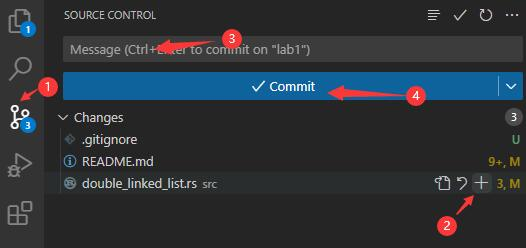
点击切换到vscode的git面板，然后在Changes里面的文件中找到你要添加的修改文件。点击上面的加号确认修改，在Message框中输入commit的信息，最后点击Commit创建一个commitment。

### patch

在完成练习后，你需要生成一个git patch。

使用`git log`查看之前的commit id，复制后，按`q`退出。  

找到你提交的commit范围

```bash
git format-patch <from>..<to> –-stdout > example.patch
# 或者
git format-patch -<向前n个commit> HEAD --stdout > example.patch
# 只有一个commit就可以用
git format-patch -1 HEAD --stdout > example.patch
```

就会在当前目录下面创建一个`example.patch`文件，你只需要提交这个文件就可以了。  

例如下图中,commit id的范围是5d87bc88d72d 到 a181054e61cda75，
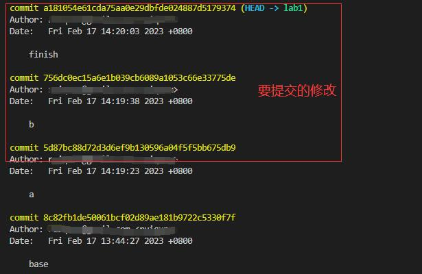

因此可以用：

```
git format-patch 5d87bc88d72d..a181054e61cda75 --stdout > example.patch
```

### 在平台上提交

我们搭建了一个网站来接收和运行git patch，目前的url为：<http://10.109.246.160:8765/login>

登录后，将文件在提交界面上传即可。
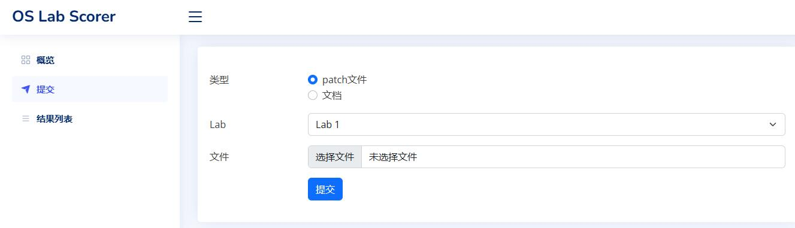
你可以看到运行的结果和日志输出。
