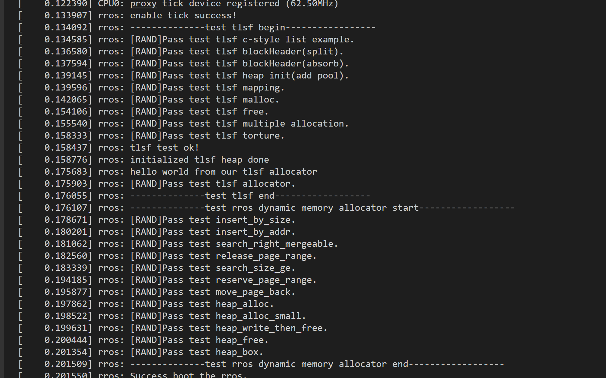
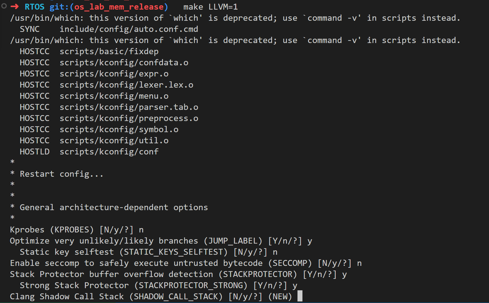
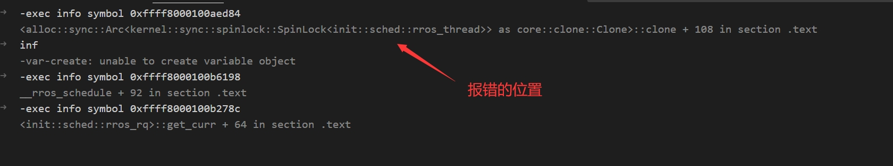

# OS Lab 4  实时内存分配器
文档还在持续完善中...   
**DDL: 2023.5.12 24:00**
## 更新日志
2023-4-11 修复了一个编译错误，**重新更新**了lab4.patch

2023-4-13 提供了一个新的.config文件，具体原因见[附录](#附录)

2023-4-22 更新文档要求[报告内容](#报告的内容)

2023-4-23 修复了lab测试的一些错误(见[test_fix.patch](./test_fix.patch))，与大多数同学有关的是`test_c_style_list`。这个patch可以在你当前的commit上直接覆盖，方法和lab4.patch一样。

2023-5-9 panic如何找位置；添加一个对公式的说明。

2023-5-11 test_malloc()增加测试点；添加对提级申请的说明；对齐PDF文件。

## 目录
1. [分数](#分数)：评分的标准
2. [环境搭建](#环境搭建)： 配置本次实验的环境
2. [相关知识](#相关知识)：介绍一些关于内存分配器的知识
3. [Linux中的链表](#Linux中的链表)： 介绍一下Linux中嵌入式(`intrusive`)的链表
4. [TLSF](#tlsftwo-level-segregated-fit-实时内存分配算法): 一种实时内存分配算法的介绍。
5. [测试和对应函数](#任务)：关于TLSF的测试
6. [EVL Memeory allocator](#EVL中的实时内存分配算法)：一个更加复杂的实时内存分配器的介绍
7. [如何配置调试](#调试)
8. [附录](#附录)

## 分数
你只需要完成TLSF部分即可。其测试的分值如下：
| 项目      | 分值 |
| ------------------------- | -- |
| `test_c_style_list`       | 5  |
| `test_blockHeader_split`  | 10 |
| `test_blockHeader_absorb` | 10 |
| `test_mapping_insert`     | 5  |
| `test_init`               | 5  |
| `test_malloc`             | 15 |
| `test_free`               | 15 |
| `test_multiple_alloc`     | 10 |
| `test_torture`            | 5  |
| `tlsf_allocator`          | 5  |
| 报告                      | 15 |
|                           |  |
| 合计                      | 100 |

而rros mem作为bonus，感兴趣的同学也可以做一下。

由于内核中的内存错误会直接导致内核panic，因此我们建议你先将未完成的测试注释掉再进行编译。
### 报告的内容
报告大致需要涉及以下内容：
* 简要叙述一下各部分是如何实现的。哪个地方让你比较困惑/或者花了比较长时间调试。

* 你在完成本实验中参考的资料（没有就不用写）

* 大致花了多长时间（按小时计）完成本次实验。

* 评价一下实验的难度，可以指出一些需要改进的地方。

### 提交方法

生成git patch，提交到http://10.109.246.160:8765

## 环境搭建

你可以直接在lab2环境（docker pull l543306408/rros_lab）上面进行开发。 使用`docker attach`进入bash环境。

然后你需要将`extract_error.py`和`lab4.patch`拷进docker。你可以做一个简单的映射，也可以使用`docker cp`。我们推荐使用映射，因为后面还需要导出patch。
> 你可以通过`-v`命令创建一个docker到本地的路径映射。例如，我在桌面新建了一个文件夹叫做lab4。**在这个文件夹**里打开powershell，输入：
```
docker run -itd -v  $PWD/:/data/bupt-rtos/share --name rros_lab l543306408/rros_lab /bin/bash
```
> 这样，你在这个文件夹里的文件就可以在docker的/data/bupt-rtos/share目录下看到了。    

你也可以通过`docker cp lab4.patch <docker id>:/data/bupt-rtos/rros/lab4.patch`的方式拷贝进去。


将两个文件放到rros文件夹下的根目录，并切换到该目录，输入：
```
git apply lab4.patch
```
就能打上patch了。


打完patch后，commit一下当前的patch:
```
git add *
git commit -m "base"
```
然后就可以开始做了。   

> 上面这一步如果没做的话，提交时可能也能成功提交，但是patch文件会相对大一些。同时你的commit也会比较混乱，建议打上patch后再进行开发。

我们还提供了一个解析编译输出的脚本`extract_error.py`，同样需要移动到rros根目录下

### 编译和运行
你可以使用下面的命令编译：
```
make LLVM=1 -j12 &> compile.txt && echo "compile successfully" || python3 extract_error.py
```
如果编译成功，会输出compile successfully。
这里,-j12表示启动12个线程，你需要根据你的主机线程数进行调整。你也可以直接设置成-j12。  

否则，会打印出错误。


* 如果你修改过.config/menuconfig，或者发现编译了很久都没有结束，可以使用`make LLVM=1`查看是否有新的编译选项。若有的话，回车选择默认选项即可。

* 你也可以自己调整一下extract_error脚本以截取更好的错误信息。


使用下面的命令运行：
```
qemu-system-aarch64 -nographic  -kernel arch/arm64/boot/Image -initrd ../arm64_ramdisk/rootfs.cpio.gz -machine type=virt -cpu cortex-a57 -append "rdinit=/linuxrc console=ttyAMA0" -device virtio-scsi-device -smp 1 -m 4096 
```

使用ctrl+a+x关闭qemu 

注意，你的每次修改都需要先进行编译才会生效

## 相关知识

### 内存分配器常用机制

大多数动态内存分配(DSA)算法都使用了下面的一个或者多个机制的组合。这里将它们列出，我们主要参考了[Dynamic Storage Allocation: A Survey and Critical Review](https://users.cs.northwestern.edu/~pdinda/ics-s05/doc/dsa.pdf) ，读者感兴趣可以深入了解。

* **header**

  大多数分配器分配的块上面都会带着一个特殊的header，其中包括了块的重要信息，例如块的长度。一般来说，header字段的长度都是一个字长。由于分配的块长度一般是对齐的，尾部会有几个冗余的bit。这几个bit一般作为状态位。

* **boundary tags**

  除了header，有的块还会有footer字段。footer同样保存块长度和块是否被使用。在块需要合并的时候，可以方便地检查上面的块是否可以被合并（只需要看它的footer字段即可）。

  同时使用header和footer浪费了很多空间。但是实际上，因为我们只在合并块的时候用到footer，因此footer字段在块被使用的时候是无效的，可以只在块不被用的时候使用footer，这样footer块就没有（使用时）空间开销了。

* **link field**

  链表和树结构经常被用于管理块内存。同样，一般只有空闲块需要被管理，因此链表/树节点直接被放在空闲块内（当然，需要限制最小块的大小，以便能放下节点）；当块被分配的时候，块的所有权转移给用户，并被从链表/树上面删除。

* **lookup table**

  一些分配器不会按给定大小分配块，而是向上取整到一个大小后分配给用户。而分配器内部会按一定规则预先放好一些固定大小的块，分配时直接查找对应大小的块链表/树即可。通常会按2的幂去分配，也有使用斐波那契函数等的。但是，lookup table如果分得太细可能占用很大空间。

* **针对小对象的优化**

  对于大多数系统，分配小对象的次数会远多于大对象。因此一些分配器会特殊处理小对象的分配。一些常见的组合有：对小对象使用快速分配算法，对大对象使用节省空间的技巧；对小对象使用lookup table，对大对象使用比较复杂的计算（时间换空间）。

## Linux中的链表

相比普遍的链表实现方式，Linux内核中的链表的实现可谓独树一帜。Linux中的链表是将链表节点放到数据结构中，而不是把数据结构放到链表中。

比如说，我们有一个block结构体。通过在里面加上`list_head`字段的形式使其可以被加入链表。

```c
struct list_head{
  struct list_head *next;
  struct list_head *prev;
};
struct block{
  unsigned long id;
  struct list_head list;
};
```
然后使用下面的代码就能把一个节点加到链表里。
```c
LIST_HEAD(head);
struct block *b1 = kmalloc(sizeof(struct block),GFP_KERNEL);
b1->id = 0;
INIT_LIST_HEAD(&b1->list);

list_add(&b1->list, &head);
```
基于`container_of`宏，linux实现了很多`xxx_list_entry`的宏。这个宏可以将`list_head`转化为其结构体的指针。例如：
```c
struct block *b1 = kmalloc(sizeof(struct block),GFP_KERNEL);
struct block *b2 = list_entry(&b1->list,struct block,list);
```
通常在遍历的时候会用到这些宏。

> container_of 是一个 Linux 内核中的宏定义，用于在数据结构中通过指向其中某个成员的指针，找到该结构体的起始地址。  
> 通常，container_of 宏定义有三个参数：ptr、type 和 member，其中 ptr 是指向结构体中某个成员的指针，type 是结构体的类型，member 是结构体中成员的名称。   
> container_of 宏定义的作用是通过在结构体中成员的指针偏移量来找到结构体的起始地址。这通常是在内核代码中使用的，因为在内核中，经常需要通过指向结构体中某个成员的指针来获取整个结构体的信息

Linux kernel链表的这种设计有许多优点。比如：
* 可以在此基础上实现C的多态，一个链表上可以有不同类型的结构体。
* 只需要获取到结构体，就可以O(1)的将其从链表上删除
* 同一个结构体，可以放置多个链表节点。例如结构体A同时在链表1，2上面。你可以在链表1上面找到结构体A，使用list_entry找到结构体在链表2上面的位置。在某些场景这可能很有用。

如果你对linux链表感兴趣，可以阅读include/linux/list.h中的宏和函数。

尽管Linux kernel中链表很巧妙，但是同样可能有一些内存问题，尤其是将链表节点放到栈上面的时候。Rust for Linux根据[intrusive_collections](https://docs.rs/intrusive-collections/latest/intrusive_collections/)和内核使用场景封装了一个`RawList`。我们在此基础上面做了一些修改,并放到了`kernel/rros/tlsf_raw_list.rs::RawList`中。

在后面的实验中，你需要使用链表维护空闲块。你可以用这种风格的链表(`kernel/rros/tlsf_raw_list.rs::RawList`),也可以使用你在lab1中写好的链表（需要进行[一些修改](#tips)）。
### 如何使用`RawList`
使用`RawList`要求结构体实现`GetLinks` trait
```rust
pub trait GetLinks {
    /// The type of the entries in the list.
    type EntryType: ?Sized;

    /// Returns the links to be used when linking an entry within a list.
    fn get_links(data: &Self::EntryType) -> &Links<Self::EntryType>;
}
```
然后，在结构体中添加Links<T\>即可。
比如，下面有一个简单的结构体A：
```rust
pub struct Block{
    data : u32,
    links : Links<Block>,
}
impl GetLinks for Block{
    type EntryType = Block;
    fn get_links(data:&Self::EntryType) -> &Links<Self::EntryType> {
        &data.links
    }
}
```
我们已经为后面需要添加`Links`的结构体`FreeBlockHeader`实现了该trait，因此你可以直接使用。

### Linux链表的例子
我们这里准备了一个通过Rust Bindgen调用Linux链表函数的例子:`kernel/rros/tlsf.rs::list_example1_sort_decending_respectively`。

你需要完成这个函数。这个函数比较ex1,ex2中val1和val2的大小，将数字大的放在前面，数字小的放在后面。比如ex1.val1 > ex2.val1,那么将链表`val_list1`先放入ex1，再放入ex2。`val_list2`也是同理   

你可以通过`unsafe{rust_helper_list_add_tail()}`调用链表添加函数。

当你的代码正确的时候，你能通过测试`test_c_style_list`。


## TLSF(Two-Level Segregated Fit) 实时内存分配算法

在这一部分，我们将介绍一个比较简单的实时内存分配算法——TLSF。它在[TLSF: A new dynamic memory allocator for real-time systems(Masmano,et al.)](http://www.gii.upv.es/tlsf/files/ecrts04_tlsf.pdf)这篇论文中提出。

TLSF是针对实时操作系统的动态内存分配算法，能够在`O(1)`的时间内返回分配的内存。TLSF的分配速度快，但是相对内存利用率低，容易出现内部碎片，比较常用于嵌入式场景。

### 算法介绍

这一部分，我们将介绍TLSF算法。我们采用的实现是参考[mattconte/tlsf: Two-Level Segregated Fit memory allocator implementation. (github.com)](https://github.com/mattconte/tlsf)，这与原版的TLSF算法略有不同。

#### 空闲内存管理

TLSF将空闲内存大小在同一区间[a,b]的内存块串成链表放在一个二维数组blocks[]\[]里，数组的每个元素表示该内存区间的free list（空闲内存链表）。


具体来说，对于一个size的空闲块，查找它所在空闲链表的二维数组的索引时用到的映射公式如下：


其中f表示二维数组blocks第一层索引，s表示第二层索引，SLI(second level index)表示第二层管理的比特数。

我们规定size < 2^8Bytes的块，统一放到f=0的blocks[0]\[s]中。

第一层索引f是按2的幂进行划分，也就是说，size值最高位的1是n位，f = n-上面规定的8+1，想想为什么减去8。这样内存就被划分为了f=0时[2^8,2^9-1],f=1时[2^9,2^10-1]....。

第二层索引s进一步把每个区间分为2^{SLI}份（分成几份都可以，但是分为2^{SLI}份按位运算更好算）。一般SLI=4或者5。

注意，在具体实现中，只有size<规定的最小大小时，计算s时不必按照上图公式减去2^f。因此可以先判断一下是否size对应的f是否为0，然后特别处理。

例如，当对8字节对齐，SLI=5时，分配的内存size = 200<256，

$$
f = 0，
s = \frac{200}{256/32} = 25
$$

例如，当SLI=4, size=460时

$$
f=\log_2^{460} = 8，
s = \frac{460-256}{256/16}=12
$$


再比如，当SLI=5, size=1234时

$$
f=\log_2^{1234}= 10，
s = \frac{1234-1024}{1024/32}=6
$$

上面f的最小值一般不为0。一方面，分配块一般会有最小块的限制，例如16字节或者32字节。另一方面，内存块大小通常会规定为4字节或者8字节的整数倍，这样块大小的低2,3个bit永远为0，可以作为标志位管理内存块。

我们后面的默认实现采用的是SLI=5, 分配长度按8字节的整数倍，且小于256Bytes的内存归于f=0。

！！！注意：通过公式计算得到 f 和 s 之后需要采用**提级申请**的方式再进一步确定fl 和 sl。

假设计算所得的f s对应的空闲内存块大小在[a, b]范围内，也就是f s内的空闲块具体大小可能是a或a+1。

如果此时f s对应只有一个大小为a的空闲内存，而我们申请的size = b，虽然此时size=b计算得到同样f和s，但是明显b > a，申请到空间不够。

所以当申请的内存空间size > a时，就必须向空闲块大小范围大于[a, b]的可用f,s申请空闲块，来确保申请到的空闲内存大于等于size。

#### 内存块结构

空闲块和非空闲块的内存元数据结构如下：


可以看到，空闲块比非空闲块多了两个字段：`next_free`,`prev_free`。这两个字段是上一个小节空闲块管理中的链表用到的。`size`表示的是分配内存的大小（不包括元数据开销），上图的size是8的整数倍，因此最后3bit是空闲的，这里只用了两个bit，分别表示当前块是否空闲，以及前一个块是否空闲。`prev_phys_block` 是一个指向前一个块的指针。这里只有指向前一个块的指针，而没有指向后一个的。这是因为每个块都是紧挨着的，我们只需要将指针向后移动`sizeof(prev_phys_block) + sizeof(size) + size` 就可以跳转到下一个块。而前一个块，则无法通过这种方式得到位置。

这里可以做一个优化，让`prev_phys_block`在非空闲块中不占用位置。在算法中，`prev_phys_block`是用来做空闲块间合并的。`prev_phys_block`（指向前一个块的指针）只有在`is_prev_free`（前一个块是空闲）时才会被使用， 因此可以让`prev_phys_block`“侵占”前一个块的位置。如果前一个块有效，那么我们的`prev_phys_block`可能会被用户数据覆盖了，但是它本身也用不到，覆盖了也没事；如果前一个块是空闲的，`prev_phys_block`则不会被覆盖掉。可以参见下一小节中的示意图，其中虚线的`prev_phys_block`表示不能使用的指针，实线表示可以使用。

块的完整视图如下，其中block指针表示操作块时用的指针，而ptr是返回给用户的指针。当要释放内存时，取到的指针也是这个指针。将它向上移动两个字长就能得到操作块的指针


#### 控制块的结构体

控制块除了上面提到了二维数组链表，还有两个字段`fl_bitmap`,`sl_bitmap[]` 使用bit位表示对应区间的内存是否还有空闲。在管理内存的最后面有一个哨兵块，它的长度为0。同时，第一个块的`is_prev_free`会置为0，防止访问到分配内存外的地址。


#### 初始化

初始化时，将fl_bitmap和sl_bitmap置为0，表示没有空闲块。然后初始化blocks数组里面的链表头。

当向控制块添加一块管理的内存时，把连续的内存当做一个块插入到对应二维数组的链表中，设置bitmap。注意这个块的`size`需要预留位置给哨兵块，同时还有扣除自身元数据`size`的大小（8字节），一共是16字节。设置这个块`is_prev_free`为false，跳转到这个块最后面，插入一个哨兵块。

例如，在SLI=5的时候，初始化的时候插入的内存块是2048字节，其中16字节被用于做元数据，可用长度为2032字节。那么初始化后有两个块，一个长度为2032字节，一个长度为0字节。2032字节的块会被插入到f=10,s=31的链表里，相应的标志位也会被置位。

在后面的实现中，因为我们按8字节对齐，并且SLI=5，因此最小的大块应为256字节而不是0字节。我们可以把f减去(5+3-1)=7以节省数组空间。**后面使用fl 指代偏移后的f**，当fl=0时，区间表示[0,256)字节；当fl=1时，区间为[256,512)字节，对应原来的f=8，以此类推。

因此，插入2048字节（实际可用2032字节）时，fl=3,sl=31。`fl_bitmap |= 1 << 3`，`sl_bitmap[3] |= 1<<31`

#### 获取一块内存

当请求一块内存时，首先要把大小按8字节向上对齐。然后查找对应大小区间中的空闲链表，看是否有可用的内存。之前维护的bitmap用来寻找符合要求的最小内存块。

例如，SLI=5时，分配一块大小为460的内存，对齐后是464，那么：
$$
f=log2(464)=8,fl = 8-7=1，s = (32/256)*(464-256)=26
$$
查询bitmap，发现`sl_bitmap[1]`等于0，没有对应的块；再查询`fl_bitmap`，发现最低置位(`lowbit`)为第4个bit，`sl_bitmap[3]`的第32个bit为1，因此从`blocks[3][31]`的链表队头或者队尾取出一个空闲块。如果这时链表为空，需要对bitmap清空。

找到一个块后，还要对块进行切割，切出需要分配的字节数，剩下的内存如果可以建块，那么新建一个块，然后将它加入到空闲链表中。以上面的情况为例，得到的是2032字节的块，切出464字节后还剩1568字节，可以新建一个1560长度的块（还有8字节用于存放长度）。

最后，将得到的块转换成一个指针，返回给用户。


#### 释放一块内存

释放内存的时候，首先要把用户的指针转换成块的指针。将这个块B标记为空闲块，下一个块C的`is_prev_free`标记置为true。


然后，尝试将这个块与它的邻居（上下的块）合并。对于上面的块A，如果当前块B`is_prev_free=true`,那么合并A，B两个块，得到新的块B。同理，如果下面的块C也是空闲的，那么将它合并。最后，将当前块B插入到空闲链表中。


#### 参考

* [esp-idf的内存管理——tlsf算法](https://blog.csdn.net/gzxb1995/article/details/124504705)
* [TLSF 内存分配算法详解](https://blog.csdn.net/pwl999/article/details/118253758)

### 任务

在这一部分，你需要实现一个TLSF分配器，并通过相应测试。

你不需要独立完成全部代码，我们已经提供了BlockHeader的部分代码和一个简单的框架。你需要完成的代码主要在`kernel/rros/tlsf.rs`，测试的代码在`kernel/rros/lab_mem_test/tlsf_test.rs`。你可以通过注释掉部分代码选择性的执行测试。

你可以在必要的时候使用unsafe,但是过度地使用unsafe可能会让你花更多时间在调试上面。

你可以使用你在Lab1里面实现的链表来管理空闲内存，而不是直接使用双向指针。下面给出了一个示例的结构体定义：

```rust
const FL_INDEX_COUNT:usize = 25;
const SL_INDEX_COUNT:usize = 32;
pub struct TLSFControl<'a> {
    fl_bitmap: usize,
    sl_bitmap: [usize; FL_INDEX_COUNT],
    blocks: [[LinkedList<FreeBlockHeaerPointer>; SL_INDEX_COUNT]; FL_INDEX_COUNT],
}
```

如果你不熟悉位运算，你也可以使用bool数组来替代bitmap。

虽然上面的控制块只占用几KB的内存，但是linux内核栈一般也只有4KB或者8KB，如果把上面的控制块放在内核栈上面会导致内核栈溢出。因此我们要把控制块整体放到堆上。在框架代码中，我们使用了Rust的MaybeUninit。调用Box::try_new_uninit_in没有马上进行初始化，而是返回一个`Box<MaybeUninit<T>>`.然后我们直接对堆上的内存初始化。这样可以防止在初始化阶段就发生栈溢出。

#### BlockPointer
为了方便实现，我们直接使用NonNull指针操作BlockHeader。
```rust
#[derive(Clone, Copy)]
pub struct AutoDerefPointer<T>(NonNull<T>);

impl<T> Deref for AutoDerefPointer<T>{
    type Target = T;
    fn deref(&self) -> &Self::Target{
        unsafe{
            self.0.as_ref()
        }
    }
}

impl<T> DerefMut for AutoDerefPointer<T>{
    fn deref_mut(&mut self) -> &mut Self::Target{
        unsafe{
            self.0.as_mut()
        }
    }
}

pub type BlockHeaderPointer = AutoDerefPointer<BlockHeader>;
pub type FreeBlockHeaderPointer = AutoDerefPointer<FreeBlockHeader>;
```

NonNull是对`*mut`的一个封装。使用时需要通过`unsafe{ptr.0.as_mut()}`来获得对该地址的引用。
例如p是一个`BlockHeaderPointer`，那么不需要通过`unsafe{p.0.as_mut()}.get_size()`来获取大小，我们可以直接使用`p.get_size()`获取一个blockHeader的大小。`FreeBlockHeaderPointer`也是类似。

我们通过`BlockHeaderPointer::from_raw_pointer()`来获取一个block的引用，这个函数会检查该地址是否包含magic number。如果这个block是一个没有初始化过的地址，你需要使用`unsafe BlockHeaderPointer::from_raw_pointer_unchecked`.


#### 实现BlockHeader的split和absorb

我们已经实现了一个简单的BlockHeader，即管理内存块的结构体，并提供了一些可能会用到的方法；你也可以重写一个BlockHeader，但是它内存中的保存方式要和下图相同（size可以不用是8字节的，4字节的u32也可以。剩下4字节放标志位）


如果你直接使用我们所给的BlockHeader，你还需要自己实现`split`和`absorb`两个函数。

* `BlockHeader::split`： 将一个块分为两个块，前一个块的大小为size，后一个块大小为`self.size-size-BLOCK_HEADER_OVERHEAD`，返回后一个块。如果无法分割，返回None
* `BlockHeader::absorb`： 找到下一个块，然后把下一个块合并到当前块上。

当你的代码正确的时候，你能通过测试`tlsf blockHeader(split)`和`tlsf blockHeader(absorb)`。

#### mapping

实现一个mapping函数，将size映射为对应的f和s。完善

* `mapping_insert` 将size映射到fl和sl函数。


后面你会用到mapping函数。一共有两个mapping函数，`mapping_insert`和`mapping_search`（已实现）。`mapping_insert`在插入空闲块时使用，`mapping_search`用于分配内存时获取比给定size稍大的块。

当你的代码正确的时候，你能通过测试`test_mapping_insert`

#### 堆的初始化

接下来实现堆的初始化。完善

* `TLSFControl::init_on_heap`： 初始化控制块
* `TLSFControl::add_pool` : 将一个内存地址加入管理
* `init_block` : 初始化一个内存，并添加哨兵块（无测试）

你可能还需要一个辅助函数`insert_block`

当你的代码正确的时候，你应该能通过测试`test_init`。


#### malloc

下面实现一个malloc的接口。你可以参考下面的伪代码：

```
void* malloc(self,size){
	var size = adjust_size(size); // 将size向上对齐，可以使用align_up函数
	var block = self.block_locate_free(size); //找到一个合适的块
	if !block{
		return null;// 返回空指针
	}
	var remain_block = block.split(size); // 把原来的块切成两部分
	设置remain_block的标记位，并把remain_block的上一个块设置为block的地址
	self.insert(remain_block); // 加入空闲链表
	return block.get_ptr(); // 返回指针
}
```

完善`TLSFControl::malloc`函数。你可能需要花较多时间在`block_locate_free`函数。

当你的代码正确的时候，你应该能通过测试`test_malloc`。

#### 内存释放
最后实现一个free的接口。这是free的伪代码：

```
void free(self,ptr){
	var block = BlockHeader::from_raw_pointer(ptr);
	将block设置为free，同时block的下一个块的is_prev_free要设置为true.
	尝试合并上一块和当前块
	尝试合并当前块和下一块
	self.insert(block); // 将当前块插入空闲链表
}
```

完善`TLSFControl::free`函数。

当你的代码正确的时候，你应该能通过测试`test_free`和`test_multiple_alloc`,`test_torture`。

#### rust的alloc_api

rust提供了一个`Allocator` trait。当一个结构体实现了`allocate`和`deallocate`两个属性时，它就能成为一个`Allocator` 。我们已经为`TLSFMem`实现了`Allocator` 。`tlsf.rs`声明了一个全局静态变量`TLSFHeap`。构造器对象`TLSFMem`会调用`TLSFHeap`进行内存分配和销毁。`TLSFMem`初始时是一个None。当调用init_tlsfheap时，会分配给堆若干个页，然后初始化内存池。

```rust
pub fn init_tlsfheap(){
    unsafe{
        let tmp = Box::<TLSFControl<'static>>::try_new_uninit_in(Global).unwrap().assume_init();
        TLSFHeap = Some(
            TLSFControl::init_on_heap(tmp)
        );
        let size = 4096*4;
        let ptr = vmalloc::c_vmalloc(size).unwrap();
        TLSFHeap.as_mut().unwrap().add_pool(ptr as *mut u8,size as usize);
    }
}
```

我们编写了一个测试`tlsf_allocator`。这里会使用你写的堆进行内存的分配和销毁，

```rust
pub fn tlsf_allocator(){
    unsafe{
        for i in 0..100{
            let a = Box::try_new_in("hello world from our allocator", TLSFMem).unwrap();
            let b = Box::try_new_in(123456789, TLSFMem).unwrap();
            let c = Box::try_new_in(1.23456789, TLSFMem).unwrap();
            let d = Box::try_new_in([1,2,3,4,5,6,7,8,9,0], TLSFMem).unwrap();
            let e = Box::try_new_in((1,2,3,4,5), TLSFMem).unwrap();
        }
        let a = Box::try_new_in("hello world from our allocator", TLSFMem).unwrap();
        pr_info!("{}",a);
        pr_info!("tlsf_allocator ok");
    }
}

```

如果之前测试全部顺利通过，你应该能在运行时看到“hello world from our allocator”

#### 测试截图

当全部测试成功时，会在输出中看到：



如果某个测试失败，并且没有导致栈损坏。会打印出错误信息：


而如果测试中出现了错误，会直接导致panic，init进程被杀死：


#### TIPS：
> * 在使用堆分配内存时，和std环境下不同，你需要使用`use alloc::boxed::Box;`引入`Box`。由于rust for linux传入了`no_global_oom_handling`标志，因此不能使用`Box::new`,`Vec`等接口。你可以使用`Box::try_new_in<T,Global>.unwrap()`来替代(`use alloc::alloc::Global;`)。

## EVL中的实时内存分配算法

TLSF虽然分配速度很快，但是容易产生较多的内部碎片。在[EVL Xenomai 4](https://evlproject.org/overview/) ——一个与Linux内核无缝集成的实时开发框架中使用的是一种bucket+红黑树管理的方案，在平均速度上比TLSF略慢，但是内存利用率更高。（但是TLSF也是该系统实时内存分配的一个备选之一）


这个内存分配算法是[Design of a General Purpose Memory Allocator for the 4.3BSD UNIX† Kernel](https://docs.freebsd.org/44doc/papers/kernmalloc.pdf) 的一个变体。我们已经用rust实现了evl_heap：`rust/kernel/memory_rros.rs`。后面我们结合这个实现来说明算法。

### Overview

evl heap管理着一些free page。每个page的大小是512字节。heap上面主要有两个部分：`free_page_pool`和`fast block cache`。 如下图所示：


* `fast block cache`  保存着`2^4,2^5...2^8` 5种大小的fast block。
* `free_page_pool` 使用红黑树（实现中用的不是上图的AVL）维护的`free page`。可以同时使用大小和地址两个键进行索引（可以认为有两棵树）。

当用户请求一个大小为size 的块时：

* 如果size≤ 256Byte，那么将size向上取整到最近的2的幂（例如，24Byte就会取整到32Byte）。在`fast block cache` 里面找一个块来分配。如果没有合适的块，那么从free_page_pool里面取一个页出来，连着对应大小的fast block cache上面，然后重新尝试分配。
* 否则，将请求的大小size取整到最近的2的幂，然后分配一串连续的页给用户。

下面我们结合具体代码来了解一下这个算法。

### 数据结构

```rust
#[repr(C)]
union pginfo {
    map: u32,
    bsize: u32,
}

pub struct evl_heap_pgentry {
    pub prev: u32,
    pub next: u32,
    pub page_type: u32,
    pginfo: pginfo,
}

pub struct evl_heap_range {
    pub addr_node: bindings::rb_node,
    pub size_node: bindings::rb_node,
    pub size: size_t,
}

pub struct evl_heap {
    pub membase: *mut u8,
    pub addr_tree: Option<bindings::rb_root>, //根据首地址找大小
    pub size_tree: Option<bindings::rb_root>, //根据大小找首地址
    pub pagemap: Option<*mut evl_heap_pgentry>,
    pub usable_size: size_t,
    pub used_size: size_t,
    pub buckets: [u32; EVL_HEAP_MAX_BUCKETS as usize],
    pub lock: Option<SpinLock<i32>>,
}
```

这里主要有三个结构体。

* `evl_heap`是堆的控制结构体，保存和堆分配有关的元信息。`addr_tree`，`size_tree`分别是地址和大小红黑树的节点。这里和之前的TLSF不同，页头不是保存在页上，而是重新分配一个空间（`pagemap`）来存放。`pagemap`是一个大小为最大页长*`sizeof(evl_heap_pgentry)`的数组。`usable_size`是可用空间，`used_size`是已用空间，`buckets`是上图`Fast Block Cache`，可以认为是链表头。
* `evl_heap_range` 是保存在空闲空间上管理页的元数据。上面有两个红黑树节点和表示当前块大小的字段。当分配出去后，这些数据会被用户数据覆盖。
* `evl_heap_pgentry` 管理分配出去页的元数据。
  * 对于普通页，有用的信息是`pginfo`，保存的是页的大小
  * 对于`block cache`页，使用`prev`和`next`链接起来，`pginfo`保存的是已分配出去的页（使用bit维护）。

### 堆的初始化(`evl_heap::init`)

1. 设置初始值

   * 将`buckets`里面的均设为max int，表示bucket为空
   * 初始化`lock`
   * 设置`membase`,`useble_size`,`size_tree`,`addr_tree`等的初始值

2. `release_page_range`：将传入物理内存视为一个整个页，然后释放。

   因为初始时红黑树上没有节点，因此没有左边的节点或者右边的可以合并。会直接跳转到`insert_range_byaddr(freed)`和`insert_range_bysize(freed)`。也就是把在红黑树内新建一个长度size的块。

### `Fast Block Cache`空间管理

`Fast_Block_cache`是一个链表的结构，但是用的是页号而不是指针。链表头是`self.buckets`，链表节点在页的元数据上。

这里提供了几个函数来管理链表。

#### `remove_page`

在链表上删除一个页。

* 如果当前只有一个项，把链表头修改即可。
* 按正常链表操作移除一个页。具体来说，就是先从`pagemap`上取元数据的结构体指针，那么进行赋值。如果当前页是链表头(`self.buckets`)，那么需要修改链表头。

#### `add_page_front`

在链表最前面添加一个新的节点。

* 如果当前链表为空（`self.buckets[ilog] == u32::MAX`），直接将链表头指向对应页`pg`即可。

  将当前`pg`链表前后指针指向自身。

* 否则，先找到第一个页，然后链接第一个页和当前页，表头和第一个页。

#### `move_page_front`

把某个页移动到链表最前面。

具体的实现是，把页从链表中移除（`remove_page`），然后重新添加到头（`add_page_front`）。

#### `move_page_back`

把某个页移动到链表最后面

和上面的思路类似，把页从链表中移除（`remove_page`），然后重新添加到尾部。

### 树上空闲空间管理

#### 插入节点`insert_range_byaddr,insert_range_bysize`

* `insert_range_byaddr`

  首先获取根节点地址树的树根，遍历红黑树，直到找到合适的地方插入。

  ```rust
  while !new_link.is_null() {
      let p = crate::container_of!(*new_link, evl_heap_range, addr_node);
      parent = *new_link;
      if (r as u64) < (p as u64) {
          new_link = &mut (*parent).rb_left;
      } else {            
          new_link = &mut (*parent).rb_right;
      }
  }
  ```

  `new_link`是rbnode节点。这里使用了linux的宏`container_of`。`container_of`能够将结构体成员变量指针转换成结构体的指针。例如，这里`new_link`是某个`evl_heap_range`结构体的`addr_node`，我们通过这个宏就能得到对应的`evl_heap_range`结构体。然后比较传入页&r和该页地址&p，如果r的地址相对较小，就进入左子树；否则进入右子树。

  最后调用了`rb_link_node`和`rb_insert_color`。前者是把节点插入到红黑树中，后者是让红黑树重新平衡。这两个函数是linux 红黑树的函数`rb_link_node`和`rb_insert_color。`如果你对这两个函数感兴趣，可以查看`lib/rbtree.c`

* `insert_range_bysize`

  和上面类似,只是比较的对象变为了size。

#### 释放空间(`evl_heap::release_page_range`)

传入的地址头是一个`evl_heap_range`。

接下来尝试合并左边（`search_left_mergeable`）和右边（`search_right_mergeable`）。这里的左边在内存上对应低地址，右边是高地址，后面都使用左右来描述低高地址。

这两个函数是类似的，因此只说明`search_right_mergeable`。

* `search_left_mergeable`

  找到可以合并的左地址，返回可以合并的块头。

  * 遍历红黑树去找最近的地址（只有空闲的块才会被加入管理）
  * 如果块头加上块大小（也就是下一个块）是当前块地址，说明这个就是要合并的块。

* `search_right_mergeable`

  和上面的函数类似，但是检查时是判断当前块加上当前块地址等于（也就是当前块的下一个块）树上的地址。

当找到合适的块时，进行合并操作：

* 调用`rb_erase(node,root)` 删除size树上的节点，把当前块合并到左边/右边的块里。注意，这里没有在`addr`树上删除节点。

合并有四种情况：

* 没有发生合并： 

  * 把当前块地址插入到`addr`树上(`insert_range_byaddr`)

* 只合并左边： 

  * 当前块合并到左边（低地址块）。
  * 因为新块大小变化了，需要把旧的长度删掉，换成新的（要先删除后插入）。但是地址`addr_node`不需要变更。

* 只合并右边：

  * 右边（高地址）的块并入当前（低地址的）块。
  * 和上面类似，要删除原来右边的`size_node`，插入新的`size_node`。同时，新的地址应该用新的块的`addr_node`。这里可以调用`rb_replace_node`把原来的右块的`addr_node`**替换**为当前块的`addr_node`。

  ```rust
   let freed_node_links = unsafe{addr_of_mut!((*freed).addr_node)};
                      unsafe{bindings::rb_replace_node(node_links, freed_node_links, root)};
  ```

* 两边都发生了合并：

  * 全部合并到最左边的块
  * 删除左边和右边的`size_node`，删除右边的`addr_node`，插入新的块的`size_node`


### malloc: 分配一块区间（`evl_alloc_chunk`）

* 首先要把请求的字节大小对齐

  * 如果小于16Byte（EVL_HEAP_MIN_ALIGN），那么直接按16字节分配

  * 如果在16-512Byte之间，那么向上对齐到最近的2的幂。

    例如，17B =>  32B , 432 => 512Byte

  * 如果大于512Byte，那么会对齐到整数页的大小（每个页512B）

    例如，700 => 1024, 1200=>1536

* 接下来从空闲区取出所需的空间。

  * 对于大于512字节的，调用`add_free_range`请求一个空闲空间（可以跳转到下面的小节阅读）。
  * 对于小于等于256字节的请求，如果尝试在`fast block cache`里面没有可以用的页，那么先申请一个页，加入到`fast block cache`，然后再从`cache`里面取。


#### 请求页（`add_free_range`，`reserve_page_range`）

在需要新增页时，主要会调用`add_free_range`，`reserve_page_range`和`search_size_ge`。`add_free_range`主要负责管理used page上的元数据，`reserve_page_range`管理红黑树上的空闲空间，`search_size_ge`在树上找到合适的块。

请求的大致流程如下：

* 在空闲树找到一个块
* 把块取下，如果有多余的空间放回空闲树
* 管理使用中块的元数据

下面按执行顺序依次介绍这三个函数。

##### `search_size_ge`

这个函数遍历size树，找到一个不小于请求要求大小的块

##### `reserve_page_range`

调用这个函数会从空闲树上取一个合适的块。如果块太大了，会把多余的部分放回树上。

* 首先已有的空闲树上找到一个合适的块（不小于当前请求大小）(``search_size_ge``)

* 将空闲块从size红黑树上取下（`rb_erase`)

* 如果

  * 空闲块的大小恰好等于请求大小：从addr红黑树上取下节点(`rb_erase`)

  * 否则，把块分割成两块。前面一块是空闲块，后面一块是分配给用户的块。这里前面那块没有在addr树上被移除，因此只需要在size树插入空闲块新的大小即可(`insert_range_bysize`)。

    这里直接使用了指针偏移计算下一个块的头部。这里的size是包括头部的长度，因此只需要直接向后移动(old_size - request_size)字节

* 最后，返回新地址的虚拟页号(`addr_to_pagenr`)，也就是`(当前地址-基址) / 512`。

##### `add_free_range`

在取得页号后，开始设置`pagemap`上面的元数据。之前提到过，`pagemap`是一个长度为页数*`sizeof(evl_heap_pgentry)`的空间，也就是一个数组。这里用的是指针，使用引用可能会更好（但是编写起来需要考虑生命周期）。通过页号取得对应空间的结构体。

* 对于`fast block cache page`（内部块小于256长度）的页，设置page_type=`log2size`。例如16字节为4,32字节为5，那么设置页类型(`page_type`)为log2size, `pginfo`使用`map`模式。这里是一个位运算掩码，用于标记哪些块被用到了。

  ```c
  pub fn gen_block_mask(log2size: i32) -> u32 {
      return u32::MAX >> (32 - (EVL_HEAP_PAGE_SIZE >> log2size));
  } 
  ```

  上面`HEAP_PAGE_SIZE`是512，`EVL_HEAP_PAGE_SIZE >> log2size`就是每个大块能容纳的小块数量。例如，`log2size`为4，也就是16字节时，结果为32。

  一开始mask是32个1bit，然后**无符号右移**若干个bit后得到新的掩码：

  | log2size | mask       | ~mask      | 可用 |
  | -------- | ---------- | ---------- | ---- |
  | 4        | 0xFFFFFFFF | 0X00000000 | 32   |
  | 5        | 0X0000FFFF | 0xFFFF0000 | 16   |
  | 6        | 0X000000FF | 0XFFFFFF00 | 8    |
  | 7        | 0X0000000F | 0XFFFFFFF0 | 4    |
  | 8        | 0X00000003 | 0XFFFFFFFC | 2    |

  对掩码取反后再对1取或表示第一个块已使用：`!gen_block_mask(log2size) | 1`

  然后调用`add_page_front`把这个块移动到链表最前面。

  （这里简单说明，具体可以看后面`fast block cache`链表部分）

* 对于普通页，传入的`log2size=0`，设置`page_type`为2，`pginfo`设置为`bsize=申请的大小`

最后，在全局`used_size`加上`bsize`，然后把页号转换为地址返回给用户。

#### 对于`fast block cache` 页的处理

对于16,32,64,128,256长度的块，总体的思路是

* 如果bucket上一个块也没分配：调用`add_free_range`返回新的块。

* 如果最近的块已经分配完了，也就是`map==0xFFFFFFFF`,那么给这个bucket申请一个新的块返回。

* 如果最近的块还有空间，那么根据`map`找到一个合适位置，这里用的是`ffs(map)-1`。ffs表示找最低位的1的位置，ffs-1把[1,32]映射到[0,31]，实际效果和`rust`中的[`trailing_zeros`]([usize - Rust (rust-lang.org)](https://doc.rust-lang.org/std/primitive.usize.html#examples-7)) 类似。 

  最后，检查一下这个page是否用完，如果用完了，调用`move_page_back`把这个页放到最后面去

### free: 释放一段堆内存(`evl_free_chunk`)

 传入一个裸指针,通过裸指针与基地址的偏移可以得到页号。

如果页类型是

* 普通页(`0x2`)  ： 调用`release_page_range`释放。
* `fast block cache` 页(`0x4,5,6,7或8`)：
  * 首先使用`EVL_HEAP_PAGE_MASK`计算出偏移量，如果偏移量不正确会报错
  * 把`pginfo.map`对应的bit置为0
  * 尝试释放页或者把页移到前面去
    * 如果当前页没有分配任何一个块，调用`remove_page`从链表中删除，然后调用`release_page_range`加入红黑树。
    * 如果当前页之前分配满了（分配完的块会自动移动最后面去），那么现在因为有了一个空位，可以移到最前面了(`move_page_front`)。
* 扣除`used_size`

### 与rust的接口

TLSF提到Rust 的allocator接口，这里接口和之前类似，但是实现是仿写rust std里allocator的实现。如果你感兴趣的话，可以查看`/rust/alloc/alloc_rros.rs`

### 任务

接下来，你需要实现上面所说的部分函数，并通过相应的测试。我们已经在上面大致讲解了函数的原理，故此处就只说明需要实现的目标。

#### 完善`insert_range_byaddr` 和`insert_range_bysize` 

```rust
    pub fn insert_range_bysize(&mut self, r: *mut evl_heap_range) {
        unsafe {
            let node_links = addr_of_mut!((*r).size_node);
            let mut root = self.size_tree.as_mut().unwrap();
            let mut new_link: &mut *mut bindings::rb_node = &mut root.rb_node;
            let mut parent = core::ptr::null_mut();
            // TODO: YOUR CODE HERE
            // while !new_link.is_null() {
            //     let p = crate::container_of!(*new_link, evl_heap_range, size_node);
            //     parent = *new_link;
            //     if ((*r).size as u64) < ( (*p).size as u64) { // FIXME
            //         new_link = &mut (*parent).rb_left;
            //     } else {            
            //         new_link = &mut (*parent).rb_right;
            //     }
            // }
            // END OF YOUR CODE
            rust_helper_rb_link_node(node_links, parent, new_link);
            bindings::rb_insert_color(node_links, root);
        }
    }
```

我们提供了部分代码作为框架，其中`rust_helper_rb_link_node`和`rb_insert_color`是插入红黑树节点。

如果你的实现正确，你应该能通过`test_insert_bysize`和`test_insert_byaddr`

#### `search_right_mergeable`

找到可以合并的右地址，返回可以合并的块头。

你可以参考`search_left_mergeable`来实现。

如果你的实现正确，你应该能通过`test_search_right_mergeable`

#### `search_size_ge`

找到不小于请求大小的块。这里不要求是`best fit`，即使你的实现是`worst fit`也可以。只需要保证请求得到的块大于请求大小。

你可以参考前面几个练习来遍历红黑树。

> 你也可以使用`rb_next`遍历红黑树

如果你的实现正确，你应该能通过`test_search_size_ge`

#### `reserve_page_range`

释放一段空间。

这里你需要实现的部分是取到块后，将块移除`addr_tree`的操作以及切割块多余部分的操作。

如果你的实现正确，你应该能通过`test_release_page_range`

#### `move_page_back`

把链表元素放到最后面去。

例如，原来如果是2->3->4。 对页号为3的页进行此操作，变为2->4->3。

如果你的实现正确，你应该能通过`test_move_page_back`

#### `evl_chunk_alloc`

分配内存的接口。

你主要需要完成的部分是

* 计算bsize和log2size的值。其中前者是对齐后的大小，你需要注意有小于512字节的块和大于512字节的块。log2size是对size取log2的值，你可以使用`rust_helper_ilog2`

如果你的实现正确，你应该能通过`test_heap_alloc`

#### `evl_free_chunk`

释放内存的接口

你需要完成的部分是对`fast block cache`页的释放。

你可能需要用到下面的函数

* `!gen_block_mask(gen_block_mask)` 掩码
* `remove_page`在链表上删除一个页
* `release_page_range` 释放一段空间
* `move_page_front` 把页移动到链表最前面

如果你的实现正确，你应该能通过`test_rrosmem_box`

当你通过测试时，你会看到：


## 调试

调试时可能需要将编译等级调低。我们所给的配置文件`.config`应该已经配置，若没有，你可以手动配置一下。

输入`menuconfig`


> 如果出现问题，可能有两种情况：
>
> * 把窗口拉大一点
> * 看bash环境变量是否有\$CROSS_COMPILE，​\$ARCH。这些在之前应该已经配置过。
>
> ```
> # 在~/.bashrc里添加
> export CROSS_COMPILE=aarch64-linux-gnu-
> export ARCH=arm64
> ```

把`kernel hacking`  >  `Rust Hacking`  > `Optimization level` > `debug-level` 调到最低


按空格确定。向右选择Exit，按回车退出，选择保存`Yes`.

### gdb

使用gdb的remote debug可以调试内核。首先在启动内核的命令后面加上`-s -S`（-s 表示启动gdb server，-S表示不要立刻执行指令，按`c`可以开始执行）。例如：

```bash
qemu-system-aarch64 -nographic  -kernel arch/arm64/boot/Image -initrd ../arm64_ramdisk/rootfs.cpio.gz -machine type=virt -cpu cortex-a57 -append "rdinit=/linuxrc console=ttyAMA0" -device virtio-scsi-device -smp 1 -m 4096 -s -S
```

其中`arch/arm64/boot/Image`是内核的路径，`/data/rootfs.cpio.gz`是文件系统的路径

然后新建一个窗口，启动gdb(例如`rust-gdb`）。在gdb里，输入下面的命令

```
rust-gdb \
--tui vmlinux \
-ex "target remote localhost:1234"
-ex "set architecture aarch64"
-ex "set auto-load safe-path"
-ex "set lang rust"
```

> 这里可以使用tmux


然后，在文件上面断点，例如：

```
b kernel/rros/init.rs:159
```

表示在131行断点。

输入`c`(continue)开始调试。


下面给出了gdb的一些常见命令

| 命令          | 作用                               |
| ------------- | ---------------------------------- |
| c             | 跳到下一个断点                     |
| b 文件名:行号 | 设置断点                           |
| p 变量名      | 打印变量                           |
| x/            | 打印地址下的数据                   |
| finish        | 跳到当前函数的结尾                 |
| frame         | 查看栈帧                           |
| n             | next，下一步，不进入函数           |
| s             | step in， 下一步，但是可能进入函数 |

### vscode

也可以给vscode添加配置文件。

首先，同样还是在命令行启动调试的qemu：

```
qemu-system-aarch64 -nographic  -kernel arch/arm64/boot/Image -initrd ../arm64_ramdisk/rootfs.cpio.gz -machine type=virt -cpu cortex-a57 -append "rdinit=/linuxrc console=ttyAMA0" -device virtio-scsi-device -smp 1 -m 4096 -s -S
```

其中`arch/arm64/boot/Image`是内核的路径，`/data/rootfs.cpio.gz`是文件系统的路径

然后，在项目根目录的.vscode文件夹中，打开.vscode/launch.json(没有的话新建一个)，把下面的配置粘贴进去：

```json
{
    // Use IntelliSense to learn about possible attributes.
    // Hover to view descriptions of existing attributes.
    // For more information, visit: https://go.microsoft.com/fwlink/?linkid=830387
    "version": "0.2.0",
    "configurations": [
        {
            "name": "kernel-debug",
            "type": "cppdbg",
            "request": "launch",
            "miDebuggerServerAddress": "127.0.0.1:1234",
            "program": "${workspaceFolder}/vmlinux",
            "args": [],
            "stopAtEntry": false,
            "cwd": "${workspaceFolder}",
            "environment": [],
            "externalConsole": false,
            "logging": {
                "engineLogging": false
            },
            "MIMode": "gdb",
            "miDebuggerPath" : "/root/.cargo/bin/rust-gdb",
            // "miDebuggerPath":"/usr/bin/gdb-multiarch",
            "setupCommands": [
                {
                    "description": "set language rust",
                    "text": "set lang rust",
                    "ignoreFailures": true
                }
            ]
        }
    ]
}
```

在行号处点击断点，按F5开始调试


如果需要使用gdb命令，可以在下面`DEBUG CONSOLE`，输入-exec {gdb命令}执行


## 附录
### kernel panic后无限重启
这个feature在调试时比较有用，如果要关掉这个feature，以下几种方法都可以：（选一种即可）
#### 改qemu的选项
只需要在qemu的运行选项后面加上`-no-reboot`选项即可。
```bash
qemu-system-aarch64 -no-reboot -nographic  -kernel arch/arm64/boot/Image -initrd ../arm64_ramdisk/rootfs.cpio.gz -machine type=virt -cpu cortex-a57 -append "rdinit=/linuxrc console=ttyAMA0" -device virtio-scsi-device -smp 1 -m 4096
```
注意`kernel.panic=-1`。（如果你没改过就不用管了）

#### 修改编译选项

1. `make menuconfig` 
2. 选择`Rust Hacking`

3.  选择`Debug Ops`

4. 修改Panic timeout

* 旁边的`panic on Oops`可以在非法访问内存时不panic，但是不建议开启
5. 改成一个比较大的数字即可,例如100


6. 保存配置

7. 注意，下一次编译时需要配置一些选项，手动回车跳过即可。后面就可以用前面的命令直接编译了。

## Panic了怎么看在哪里报的错？
这里提供一种方法帮助大家定位内存错误。

当使用vscode调试运行时，panic时会停在报错的位置。

也可以通过panic打印而信息来分析
下面是Panic的一个例子

这会打印出一些寄存器的值和Call trace。我们可以通过call trace来分析调用的顺序。

然后，重新启动一次gdb，然后调试，在一个不会报错的位置断点一些，运行并等待断点触发。   

在gdb控制台（或者vscode 的debug console) 输入：
```
info symbol <一个地址>
或者在vscode中
-exec info symbol <一个地址>
```
这时就能够打印出地址对应的符号位置了。


